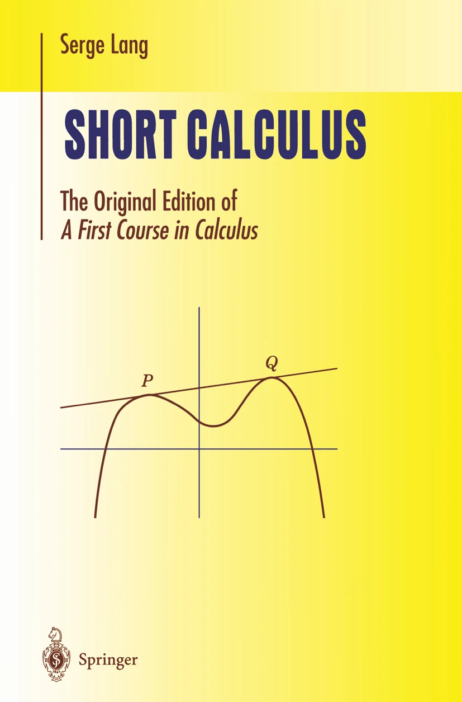
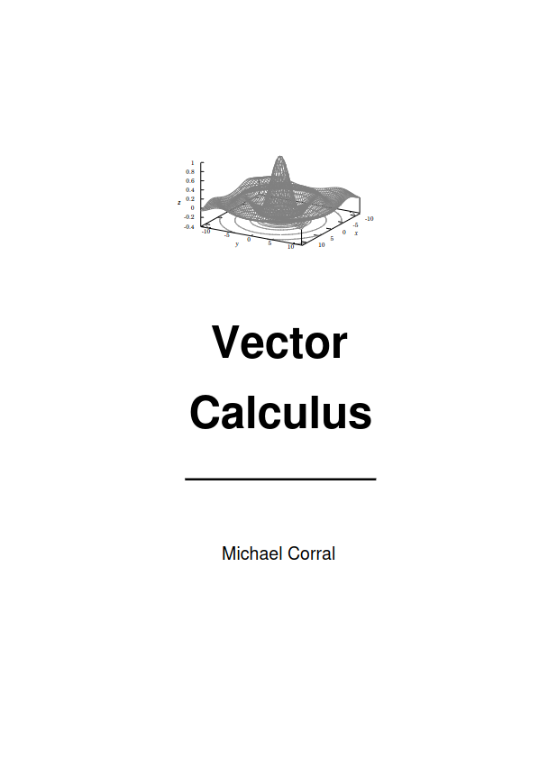
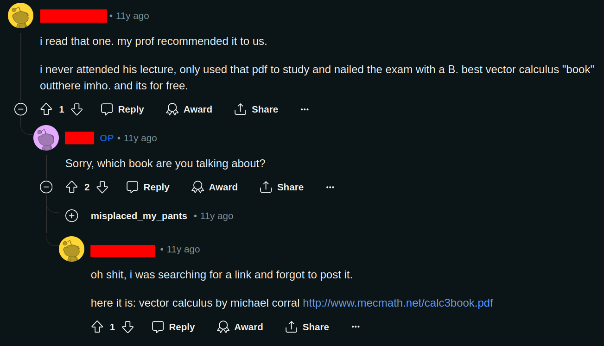
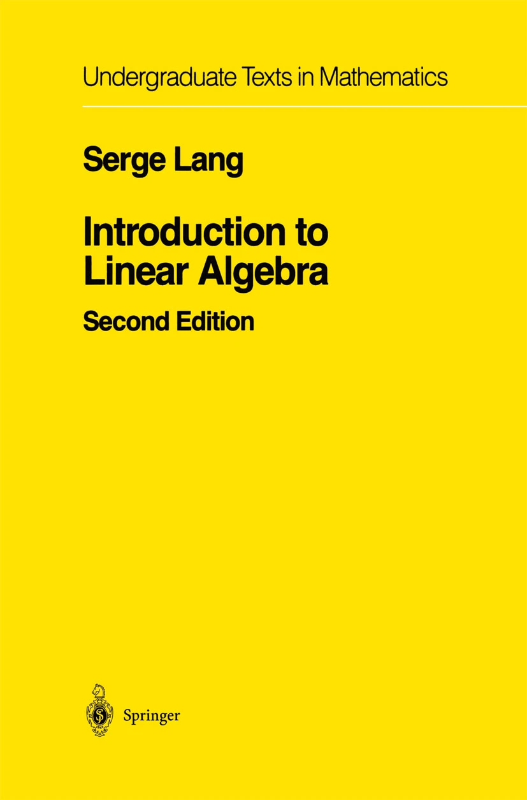
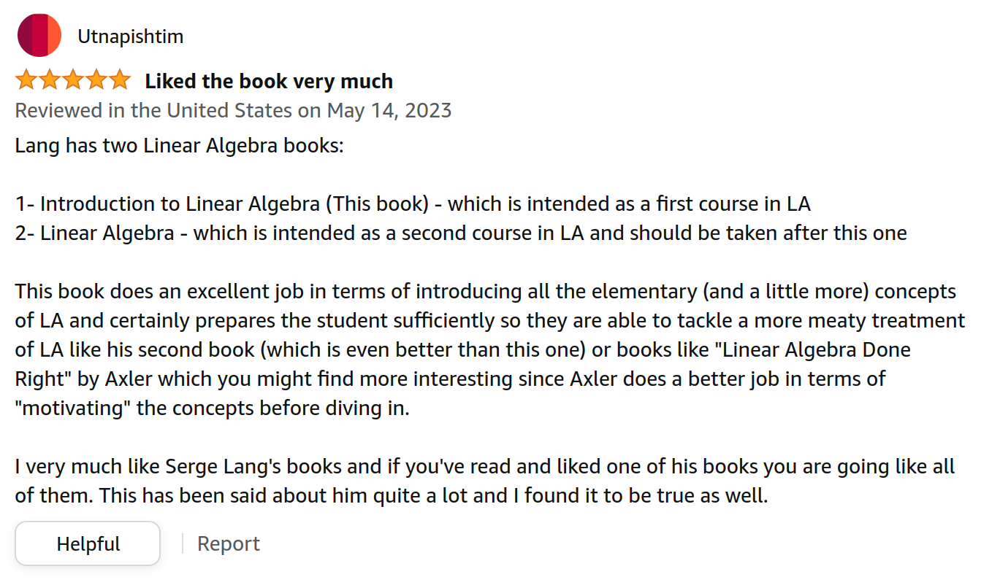
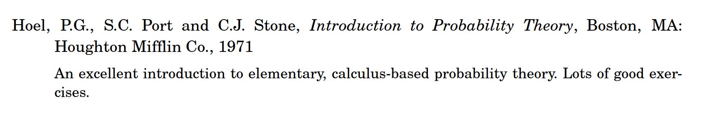

+++
title = "Math for Machine learning Curriculum"
description = "here I will go through all the mathematics required for machine learning"
date = 2024-06-09
draft = false
+++

# Strategy 

## Single Variable Calculus

We are going to use [**Short Calculus by Serge Lang**](https://link.springer.com/book/10.1007/978-1-4613-0077-9) for doing Single Variable Calculus.
I chose this textbook because I didn't want to slog through books that are 1000 pages long. It's only 272 pages.

If you read the preface then you'll realize that it is intended to be a first course in calculus for students with a weak 
background in mathematics, but it doesn't abandon the rigor.

It starts with Numbers and Functions, goes over Graphs and Curves, and after that defines the derivative.
I love how he first gives examples as a stepping stone and then generalizes them. This book is methodical and well written.

Before we dive deep into Single Variable Calculus, we will refresh our Algebra and Trigonometry and also learn Limits from
[Paul's Online Math Notes](https://tutorial.math.lamar.edu/). These are some excellent notes for that purpose. Do the 
[Algebra Trig Review](https://tutorial.math.lamar.edu/Extras/AlgebraTrigReview/AlgebraTrig.aspx) if you need it. 
I would recommend you do [Limits](https://tutorial.math.lamar.edu/Classes/CalcI/limitsIntro.aspx) up to
[2.9](https://tutorial.math.lamar.edu/Classes/CalcI/Continuity.aspx). 

## Multivariable Calculus

We are going to do Multivariable Calculus (also called Vector Calculus or Calculus-3 in some universities) from Michael Corral's
excellent and **FREE** [**Vector Calculus**](http://www.mecmath.net/).

I chose this textbook because in the preface, he wrote, "If I were to rate the level of rigor in the book on a scale of 1 to 10, with 1 being
completely informal and 10 being completely rigorous, I would rate it as a 5". Which is exactly the level of rigor we want and are capable
of understanding. 

If you check out the reviews of this book, all of them say that it's a great book.

[**SIAM Review**](http://buzzard.ups.edu/bookreview/vector-calculus-beezer-review.pdf)

## Linear Algebra 

I wanted a concise book that had both a computational and a mathematical perspective. One of the books that I found to
fall into this category was (again) [**Serge Lang's Introduction to Linear Algebra**](https://link.springer.com/book/10.1007/978-1-4612-1070-2) 

I checked some [Amazon reviews](https://www.amazon.com/Introduction-Linear-Algebra-Serge-Lang/product-reviews/3540780602), and
most of the people found it to be good!

In the preface, he states that "This book is meant as a short text in linear algebra for a one-term course," which is exactly
what we want! Lang walks through the book, establishing a connection between linear algebra and geometric intuition.

## Probability 

One day, I was randomly looking at the bibliography of Michael Corral's [Vector Calculus](http://www.mecmath.net/VectorCalculus.pdf),
and I saw that Professor Michael recommends a book on probability! 

todo()!
